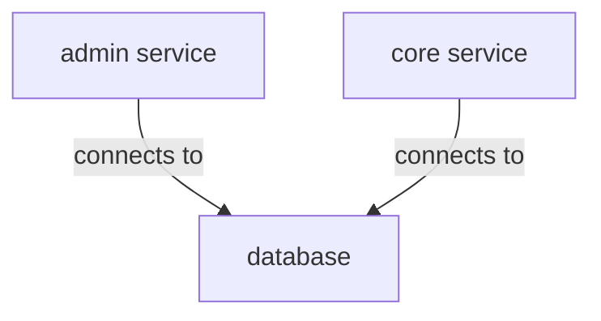

# cashback-app

## Description

This project is a simple cashback application that allows users to register, login, and view their cashback balance. The application also allows users to view their cashback balance in different currencies.

## Architecture Highlights

- The application is built using (GoFr)[https://gofr.dev/docs/quick-start/introduction] which is a framework that allows developers to build microservices in Go with ease.

- the application is contain 2 services:
    - `admin service` which is responsible for CMS operations.
    - `core service` which is responsible for the core business logic of the application.
- Both services are connected to a database.

